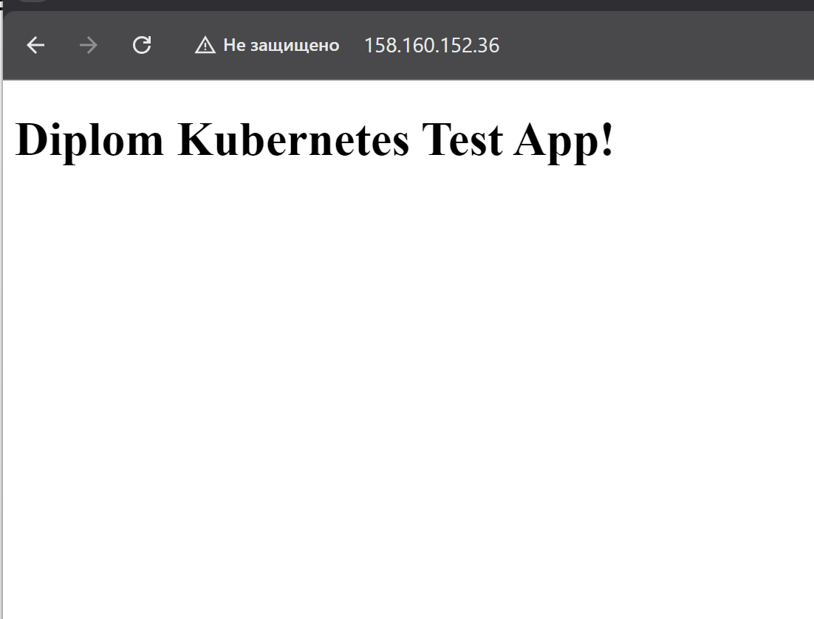

# Дипломный практикум в Yandex Cloud

## Цели
Подготовить облачную инфраструктуру в Yandex Cloud, развернуть Kubernetes‑кластер,
задеплоить тестовое приложение, настроить мониторинг и CI/CD.

## Используемые инструменты
- Terraform
- Yandex Cloud
- Yandex Managed Service for Kubernetes
- Docker
- Kubernetes
- kube‑prometheus‑stack (Prometheus + Grafana)
- GitHub Actions

## Структура репозитория
```
bootstrap/        создание service account и bucket для Terraform backend
terraform/        основная инфраструктура (VPC, подсети, Kubernetes, registry)
app/              тестовое приложение (nginx)
k8s/              Kubernetes манифесты приложения и мониторинга
.github/workflows CI/CD pipeline
img/              скриншоты для отчёта
CHECKLIST.md      порядок запуска
```

## Результат выполнения задания

После выполнения CHECKLIST.md должны быть получены:

- инфраструктура созданная Terraform
- Kubernetes кластер
- docker image тестового приложения
- приложение доступно по HTTP
- Grafana доступна по HTTP
- CI/CD pipeline для сборки и деплоя
- возможность полностью удалить инфраструктуру командой

```
terraform destroy
```

## Скриншоты

### Инфраструктура


### Kubernetes


### Grafana


### CI/CD

